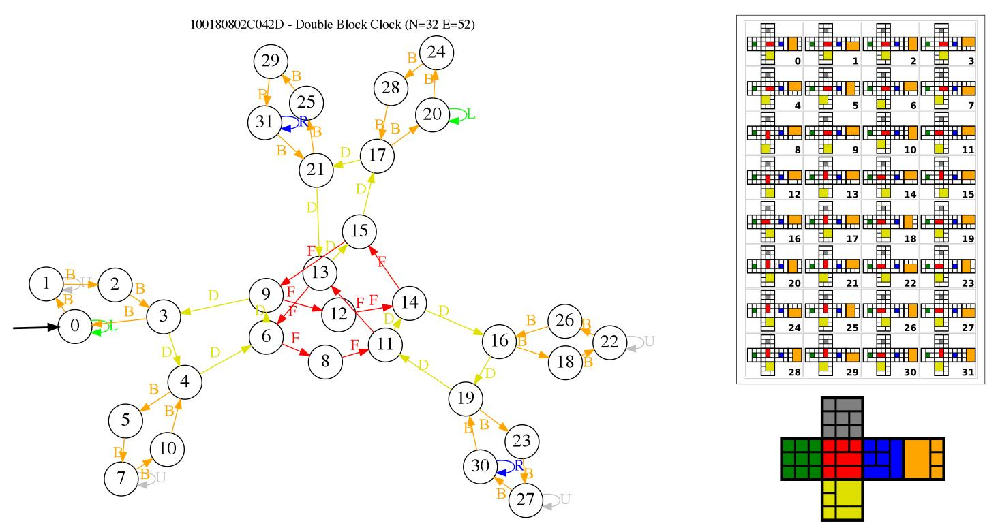

Introduction
============
This is a tool for rendering the graphs of the bandaged 3x3x3 cube puzzles.
It assumes basic knowledge of the bandage cube concepts and hex notation.

Before using this software please read the Ladislav Dubravský's [introduction](https://github.com/ladislavdubravsky/bandaged-cube-explorer) and [blog](https://ladislavdubravsky.wordpress.com/category/bandaged-3x3s/)

The "all\_cubes.csv" is generated by processing "Bandage\_List.xls" file from [twistypuzzles forum](http://www.twistypuzzles.com/forum/viewtopic.php?p=387776#p387776).

Example images
==============





Over 100 bandage cubes:[PDF](images/some_named_bandaged_cubes.pdf)

Over 2000 bandage cubes in a [250MB archive of pdf](https://drive.google.com/file/d/1SLcX1A35xX8fnC6Do4t7JdjtlQFfSqO1/view?usp=sharing).

Example usage
=============

Detailed help:
```
python paul_cube_bandaged_graph.py -h
```

To generate pdf images of several bandaged cubes (Meffert Bicube and Equator cube):
```
paul_cube_bandaged_graph.py --file_format pdf 33EC01800846 300C0000000C03
```

To generate SVG image of cab5-5 cube:
```
paul_cube_bandaged_graph.py --file_format svg --skip_legend_draw 22006F100000C6
```

To generate pdf for all named bandage cubes where the graph has less then 1000 nodes from the csv file:
```
paul_cube_bandaged_graph.py --process_csv_file all_cubes.csv --file_format pdf  --skip_cubes_without_names --filter_by_number_of_nodes 0-1000 
```


For more information, search for the topics about bandage cubes
on[forum](http://twistypuzzles.com/~sandy/forum/), visit [budlcuber2 weblog](https://budlcuber2.blogspot.com/search/label/Bandage%20Cube%20Kit) and [an archived blog post](https://web.archive.org/web/20150307203141/http://twistypuzzling.blogspot.com/2013/07/the-best-value-twisty-puzzle-ever.html).


The file "all\_cubes.csv" is generated based on the "Bandage List.xls" from http://www.twistypuzzles.com/forum/viewtopic.php?f=1&t=33692

Requirements
============

* pydot and graphviz with cairo enabled
* networkx library
* svgwrite library
* bce library from https://github.com/ladislavdubravsky/bandaged-cube-explorer

The software has been tested on Linux.


